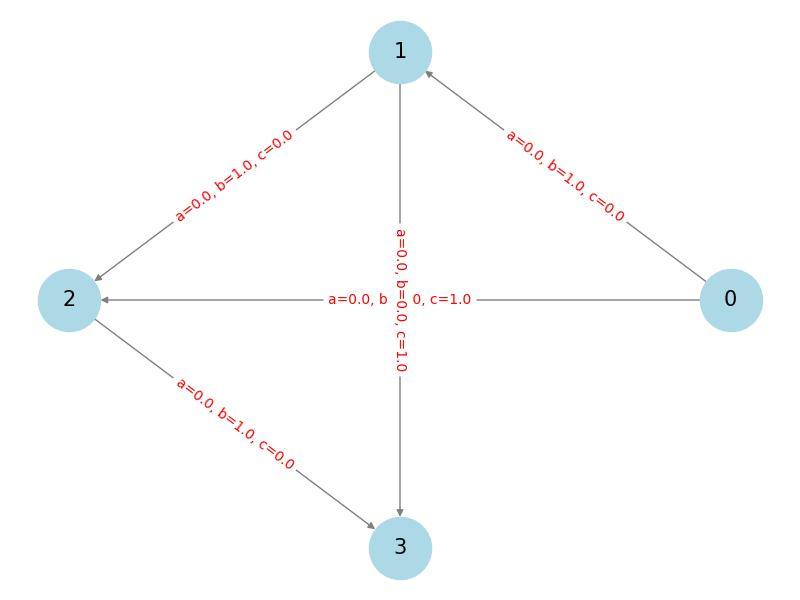

# NE Flow and PoC

## Representation of the network with quadratic latency functions

### Storage
A single network with quadratic latency functions is represented by 3 adjacency matrix.
One matrix per coefient (a,b,c) where the function has the following form:

ax^2 + bx + c 

## In Python
The coefficients are loaded and the `DiGraph` in `networkx` is created to such that each edge
has additional properties a,b,c. (see `load_matrix_from_csv` function).

# Socially Optimum solution
The socially optimum solution (so far continuous version) is obtained using `scipy.optimize`.

# Tests

A simple network visualization is presented on the image below

